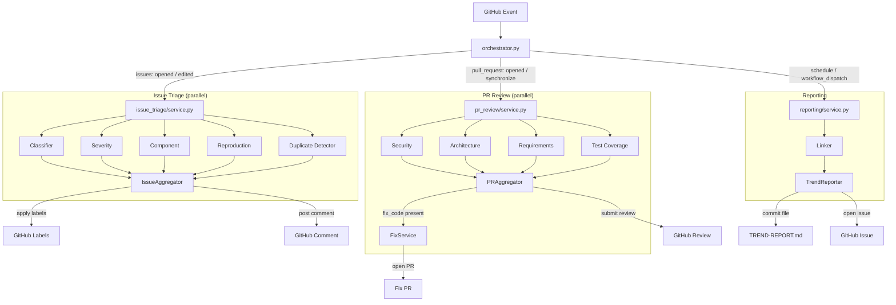
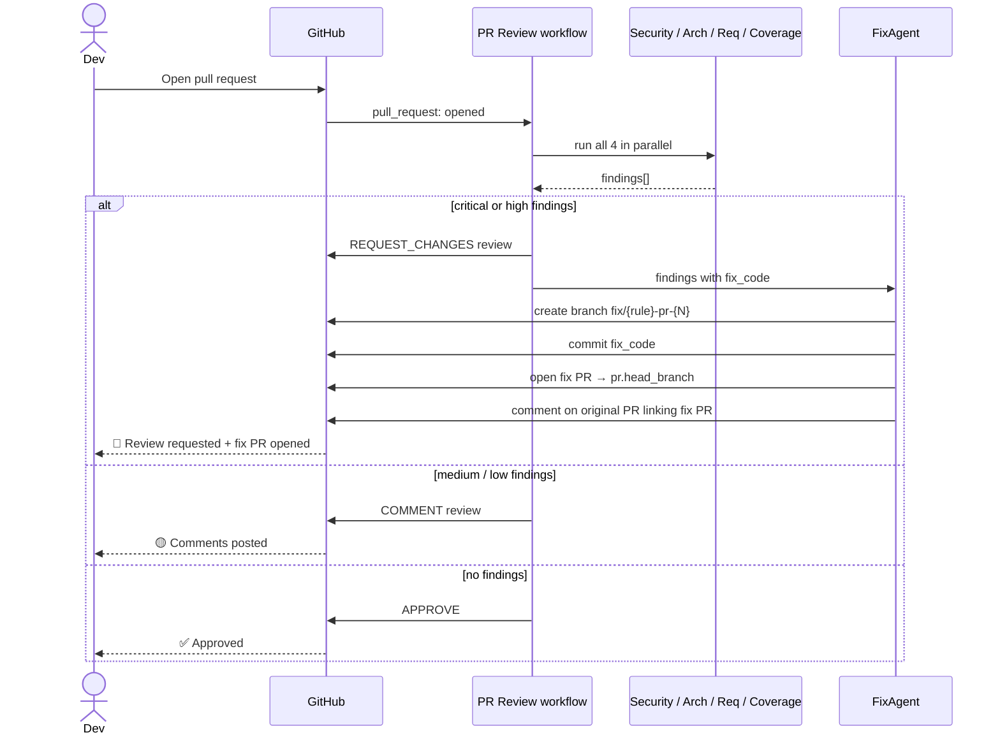
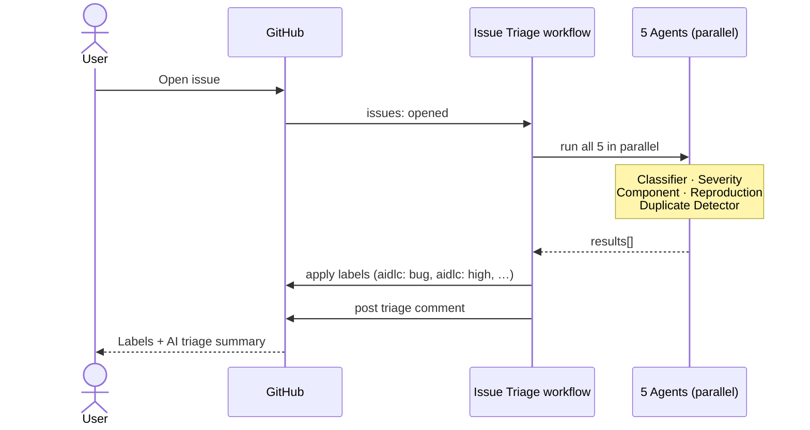

# gh-ac-1 — AI-DLC GitHub Agent

A multi-agent GitHub automation system built with the [AI-DLC](./aidlc-docs/) (AI Development Lifecycle) workflow. Agents automatically triage issues, review pull requests, create fix PRs, and generate weekly trend reports — all powered by the GitHub Models API using the built-in `GITHUB_TOKEN`.

## What it does

| Trigger | Agents | Output |
|---|---|---|
| Issue opened / edited | Classifier, Severity, Component, Reproduction, Duplicate Detector | Labels + triage comment |
| PR opened / synchronised | Security, Architecture, Requirements, Test Coverage | GitHub review (APPROVE / COMMENT / REQUEST_CHANGES) + optional fix PRs |
| Every Monday 09:00 UTC | Trend Reporter | `TREND-REPORT.md` committed + GitHub issue opened |

## Architecture



## PR Review & Auto-Fix flow



## Issue Triage flow



All agents inherit from `BaseAgent` which handles:
- GitHub Models API calls (`gpt-4o` by default, configurable via `GITHUB_MODEL`)
- Retry with exponential backoff (3 attempts)
- Soft input token budget (8 000 tokens — truncates, never rejects)
- JSON schema validation on model output

## Packages

```
agents/
  core/           Base classes, GitHub client, orchestrator, rule loader
  issue_triage/   5-agent issue triage pipeline
  pr_review/      4-agent PR review pipeline
  fix/            Auto-fix branch + PR pipeline
  reporting/      Weekly trend reporting
```

## No extra secrets needed

Everything runs on the `GITHUB_TOKEN` that GitHub Actions injects automatically. No API keys, no third-party accounts.

## Local setup

```bash
pip install requests
export GITHUB_TOKEN=<your-pat>
export GITHUB_REPOSITORY=owner/repo
export PYTHONPATH=$(pwd)

# Run tests
pip install pytest
pytest agents/*/tests/ -v
```

## Workflows

| File | Trigger | Timeout |
|---|---|---|
| `.github/workflows/issue-triage.yml` | `issues: [opened, edited]` | 5 min |
| `.github/workflows/pr-review.yml` | `pull_request: [opened, synchronize]` | 10 min |
| `.github/workflows/trend-report.yml` | Weekly cron + `workflow_dispatch` | 5 min |

## AI-DLC

This project was built using the AI-DLC adaptive workflow. Governance rules live in `.github/copilot-instructions.md` and `.aidlc-rule-details/`. The same rules are injected as system prompts into the agents via `agents/core/rule_loader.py`.

Progress is tracked in [`aidlc-docs/aidlc-state.md`](./aidlc-docs/aidlc-state.md).
